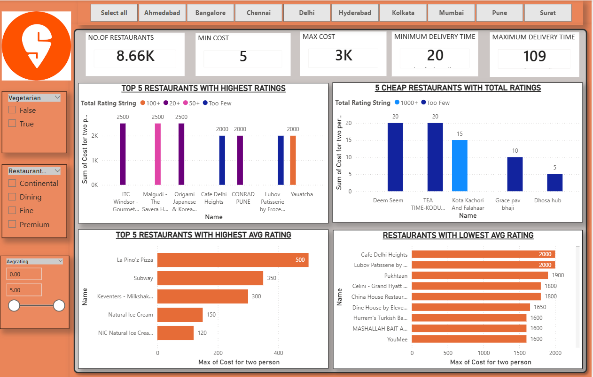

# Swiggy-Dashboard 🍔📊

This project presents an interactive Power BI dashboard built using Swiggy data to analyze sales performance, order patterns, and customer insights.

## 🖥️ Dashboard Preview

## 🎯 Key Objectives
* Analyze order trends over different time periods.
* Understand customer preferences and top-selling categories.
* Identify peak hours for better resource management.

## 🛠️ Tools Used
* **Power BI:** Data Visualization & DAX.
* **Power Query:** Data Cleaning and Transformation.
